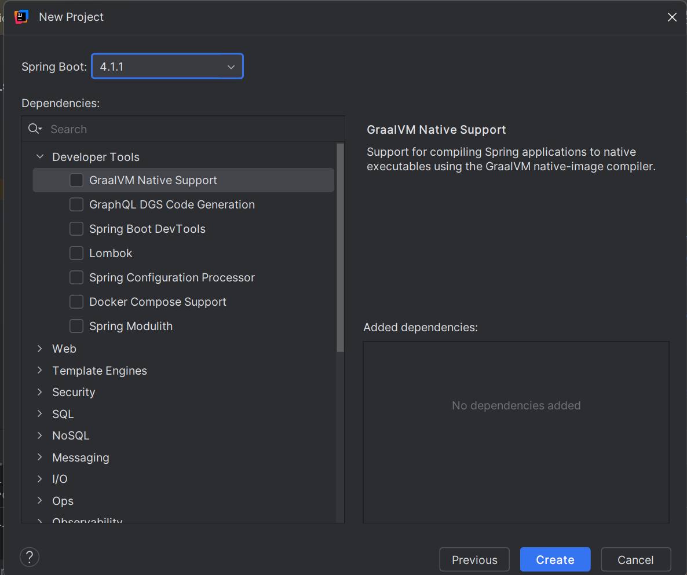
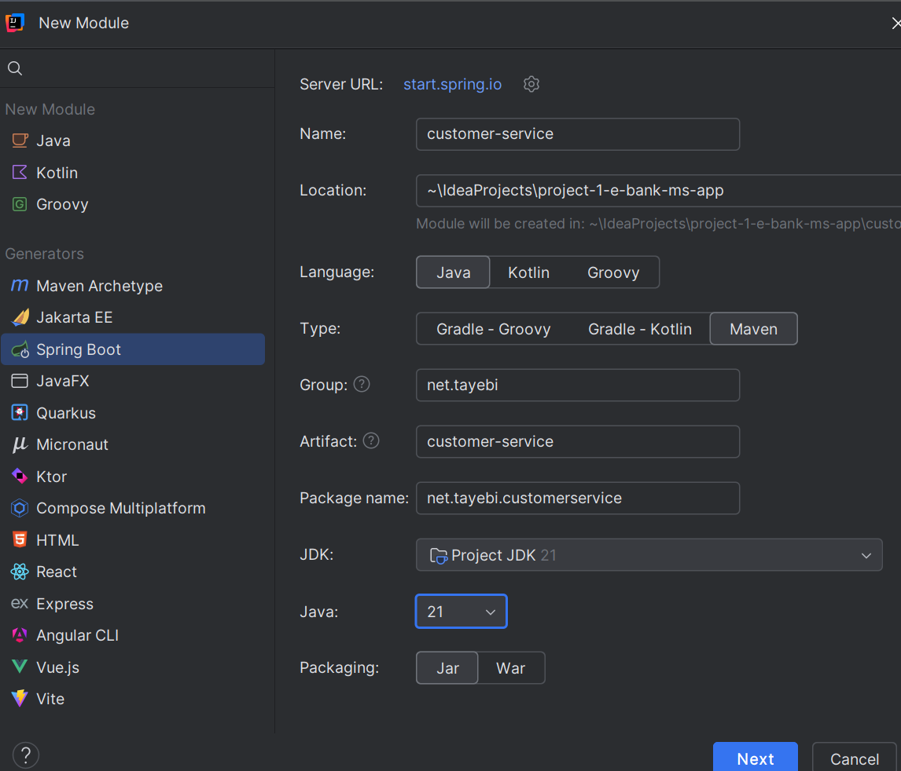
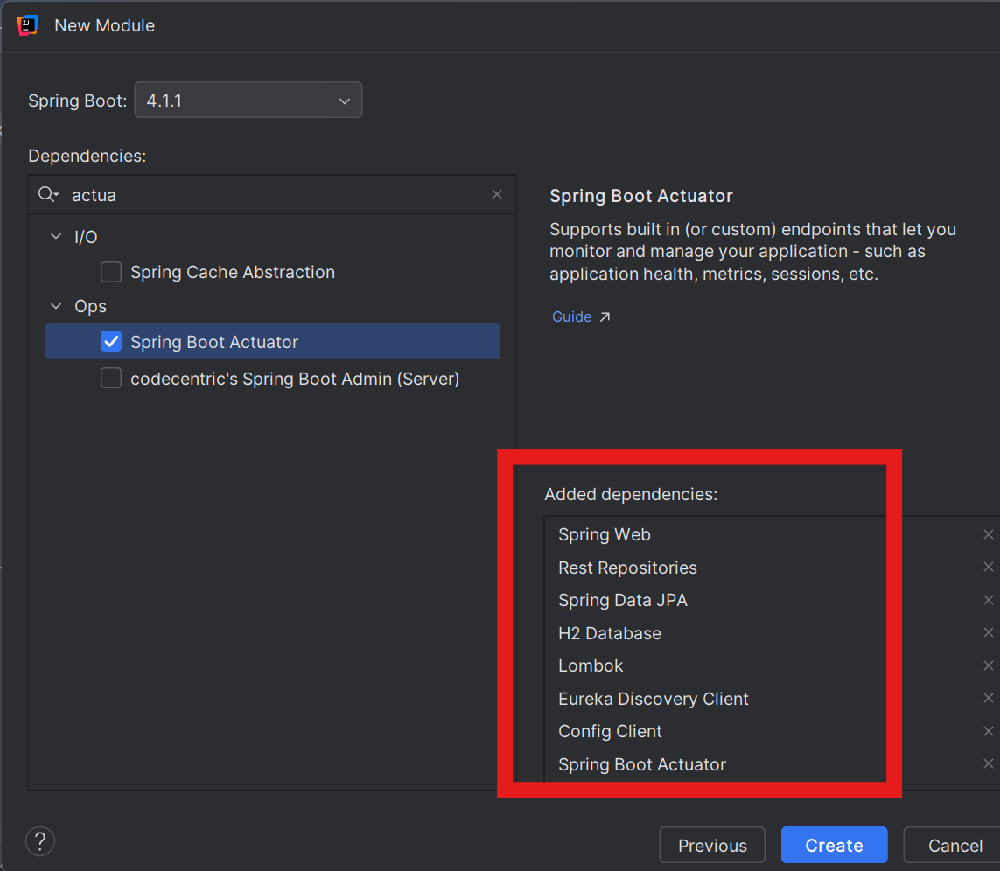
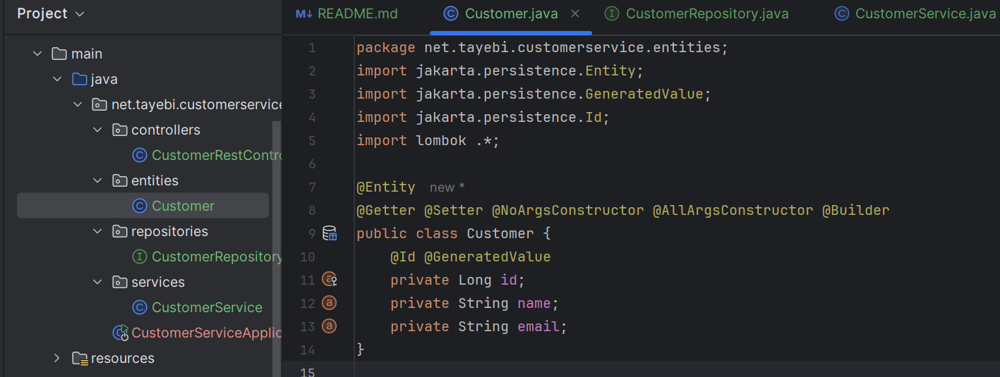
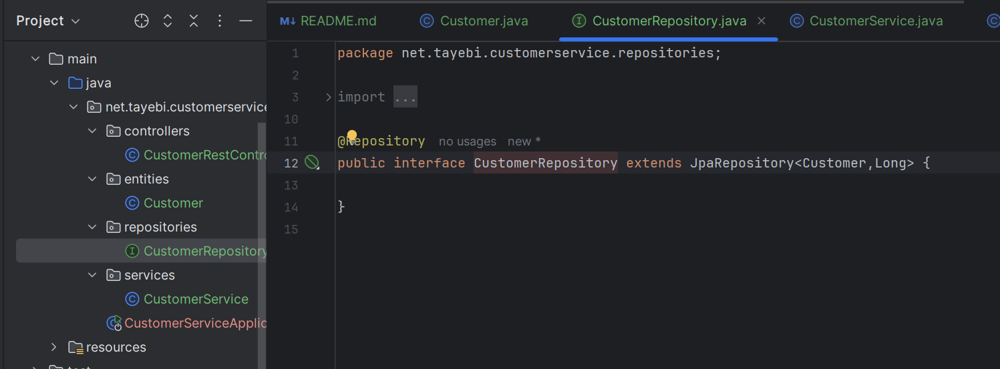
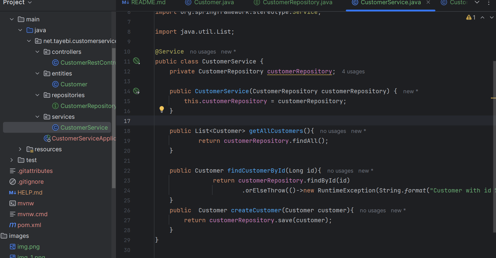
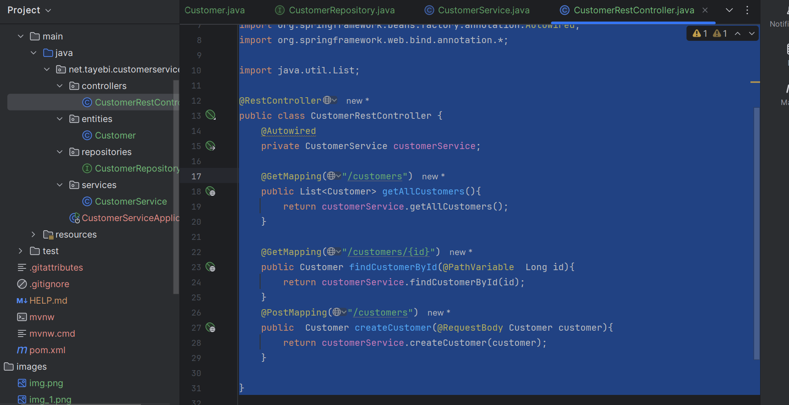

## Présentation du projet eBank

Dans ce projet, nous allons développer une application **eBank basée sur une architecture microservices**.

L'application sera composée de deux microservices métier principaux :

* **Customer Service** : ce microservice sera responsable de la gestion des clients (*Customers*).
* **eBank Service** : ce microservice sera responsable de la gestion des comptes bancaires (*Accounts*).

### Communication entre les microservices

Une relation existe entre les deux microservices, puisqu'un **compte bancaire appartient à un Customer**.

Pour permettre aux deux microservices de communiquer entre eux, nous allons utiliser une **communication REST synchrone** basée sur **OpenFeign**.

OpenFeign permettra à un microservice d'appeler facilement les endpoints REST de l'autre microservice lorsqu'une interaction entre les deux services sera nécessaire.

### Infrastructure des microservices

Pour gérer l'architecture distribuée et faciliter l'accès aux différents services, nous allons mettre en place plusieurs composants :

* **API Gateway** : point d'entrée vers les microservices.
* **Discovery Service** : permet aux microservices de s'enregistrer et de se découvrir dynamiquement.
* **Config Service** : permet de centraliser et de gérer la configuration des différents microservices.

Une fois ces différents composants créés, nous allons tester l'ensemble de l'architecture à travers un **frontend Angular**.

### Intégration de Spring AI et création du chatbot

Après avoir mis en place l'architecture de base, nous allons intégrer **Spring AI** afin de créer un nouveau microservice appelé **eBank Chatbot Service**.

Ce chatbot sera basé sur un **LLM (Large Language Model)** et permettra aux utilisateurs de poser des questions concernant leurs clients, leurs comptes et les fonctionnalités disponibles dans l'application eBank.

L'utilisateur pourra envoyer une question depuis le **frontend Angular** via le protocole **HTTP**.

Le chatbot devra alors :

1. Recevoir et analyser la question de l'utilisateur.
2. Comprendre l'intention de la question.
3. Déterminer quel microservice doit être contacté pour obtenir les informations nécessaires.
4. Appeler le service approprié.
5. Récupérer les données nécessaires.
6. Générer une réponse pertinente à partir des informations récupérées.
7. Retourner la réponse à l'utilisateur.

### Utilisation de MCP

Pour permettre au chatbot d'interagir avec les différents services, nous allons utiliser le **Model Context Protocol (MCP)**.

Nous utiliserons notamment le **transport Streamable HTTP** afin de permettre la communication entre le chatbot et les serveurs MCP.

Le point le plus important du chatbot sera sa capacité à **déterminer quel service doit être contacté en fonction de la question de l'utilisateur**.

Par exemple :

* Une question concernant les informations d'un client → **Customer Service**.
* Une question concernant un compte bancaire → **eBank Service**.
* Une question nécessitant des informations provenant des deux services → le chatbot devra être capable d'interagir avec les deux services.

Le chatbot ne devra donc pas simplement générer une réponse à partir du LLM : il devra également être capable de **sélectionner et d'utiliser les bons outils/services** afin de produire une réponse basée sur les données réelles de l'application.

### Intégration de Telegram

Enfin, nous allons intégrer un **client Telegram** afin de permettre aux utilisateurs d'interagir avec le chatbot directement depuis Telegram.

L'utilisateur pourra poser ses questions directement dans Telegram.

Dans ce cas, les requêtes passeront par **l'API Telegram** et pourront communiquer avec le **Chatbot Service sans passer directement par l'API Gateway** utilisée par le frontend Angular.

Le chatbot recevra donc les questions provenant de deux sources :

* **Frontend Angular → HTTP → Chatbot Service**
* **Telegram → Telegram API → Chatbot Service**

Dans les deux cas, le chatbot devra analyser la question, déterminer le ou les services nécessaires, récupérer les informations appropriées et générer la réponse finale.

### Architecture globale

L'architecture finale du projet sera donc composée des éléments suivants :

```text
                         ┌──────────────────┐
                         │   Angular        │
                         │    Frontend      │
                         └────────┬─────────┘
                                  │ HTTP
                                  ▼
                         ┌──────────────────┐
                         │   API Gateway    │
                         └────────┬─────────┘
                                  │
             ┌────────────────────┼────────────────────┐
             │                    │                    │
             ▼                    ▼                    ▼
      ┌─────────────┐      ┌─────────────┐     ┌──────────────┐
      │   Customer  │      │   eBank     │     │   Chatbot    │
      │   Service   │◄────►│   Service   │     │   Service    │
      └─────────────┘      └─────────────┘     └───────┬──────┘
             │                    │                    │
             │                    │                    │ MCP
             │                    │                    ▼
             │                    │             ┌──────────────┐
             │                    │             │ MCP Servers  │
             │                    │             └──────────────┘
             │                    │
             └────────────┬───────┘
                          │
                   Discovery Service
                   Config Service


      ┌─────────────────┐
      │    Telegram     │
      │     Client      │
      └────────┬────────┘
               │
               ▼
        ┌──────────────┐
        │ Telegram API │
        └──────┬───────┘
               │
               ▼
        ┌──────────────┐
        │   Chatbot    │
        │   Service    │
        └──────────────┘
```

L'objectif final est donc de construire une **application eBank moderne basée sur les microservices**, puis d'y intégrer un **chatbot intelligent basé sur Spring AI et un LLM**, capable de comprendre les questions des utilisateurs, de sélectionner automatiquement les services nécessaires via **MCP**, de récupérer les données appropriées et de générer une réponse contextualisée, avec une interaction possible à la fois depuis **Angular et Telegram**.

Voila le projet que nous avons creer
 sans aucune depndances et la on va ajoute les microserviec 
1- customer microsrevice :

avec depndecies:

spirng web , jpa , h2 db, lombok ,  eureka discovery client qui pemrte au microsrvice de senregitsrer
, checrher config via  config clien t , pusi  actuator pour ts qui est monitoring des microservice 
apres on va ajouter mcp une fois on arrive au chabot part

on cere pavkages:
enities:
Customer

repositories
CustomerRepository

 services
CustomerService

controllers

CustomerController


package net.tayebi.customerservice.entities;
import jakarta.persistence.Entity;
import jakarta.persistence.GeneratedValue;
import jakarta.persistence.Id;
import lombok .*;

@Entity
@Getter @Setter @NoArgsConstructor @AllArgsConstructor @Builder
public class Customer {
@Id @GeneratedValue
private Long id;
private String name;
private String email;
}


package net.tayebi.customerservice.repositories;

import jakarta.persistence.Entity;
import jakarta.persistence.GeneratedValue;
import jakarta.persistence.Id;
import lombok.*;
import net.tayebi.customerservice.entities.Customer;
import org.springframework.data.jpa.repository.JpaRepository;
import org.springframework.stereotype.Repository;

@Repository
public interface CustomerRepository extends JpaRepository<Customer,Long> {

}


package net.tayebi.customerservice.services;


import net.tayebi.customerservice.entities.Customer;
import net.tayebi.customerservice.repositories.CustomerRepository;
import org.springframework.stereotype.Service;

import java.util.List;

@Service
public class CustomerService {
private CustomerRepository customerRepository;

    public CustomerService(CustomerRepository customerRepository) {
        this.customerRepository = customerRepository;
    }

    public List<Customer> getAllCustomers(){
            return customerRepository.findAll();
    }

    public Customer findCustomerById(Long id){
                return customerRepository.findById(id)
                        .orElseThrow(()->new RuntimeException(String.format("Customer with id %s not found", id)));
    }
    public  Customer createCustomer(Customer customer){
        return customerRepository.save(customer);
    }
}


package net.tayebi.customerservice.controllers;


import net.tayebi.customerservice.entities.Customer;
import net.tayebi.customerservice.repositories.CustomerRepository;
import net.tayebi.customerservice.services.CustomerService;
import org.springframework.beans.factory.annotation.Autowired;
import org.springframework.web.bind.annotation.*;

import java.util.List;

@RestController
public class CustomerRestController {
@Autowired
private CustomerService customerService;

    @GetMapping("/customers")
    public List<Customer> getAllCustomers(){
        return customerService.getAllCustomers();
    }

    @GetMapping("/customers/{id}")
    public Customer findCustomerById(@PathVariable  Long id){
        return customerService.findCustomerById(id);
    }
    @PostMapping("/customers")
    public  Customer createCustomer(@RequestBody Customer customer){
        return customerService.createCustomer(customer);
    }

}
la on a path vraibale cad le param est dna sle path mas request body cad que lobj est dans le body  pas dans path
@PathVariable → donnée dans l'URL
@RequestBody → donnée dans le corps de la requête

contreler advise : permet de gere les axcepions 
on peu aussi faire des exception handler pour que si ya eception on la prend et on lenvie via http

on passe acree cmd line runner:

on ajoute notr bean qui sert acreer nos customers:
package net.tayebi.customerservice;

import net.tayebi.customerservice.entities.Customer;
import net.tayebi.customerservice.repositories.CustomerRepository;
import net.tayebi.customerservice.services.CustomerService;
import org.springframework.boot.CommandLineRunner;
import org.springframework.boot.SpringApplication;
import org.springframework.boot.autoconfigure.SpringBootApplication;
import org.springframework.context.annotation.Bean;

import java.util.List;

@SpringBootApplication
public class CustomerServiceApplication {

    public static void main(String[] args) {
        SpringApplication.run(CustomerServiceApplication.class, args);
    }
    @Bean
    public CommandLineRunner start(CustomerService customerService) {
        return args -> {
           List<String> names= List.of("siham","imane","omar","ali","fouzia" );
           names.forEach(name -> {
               customerService.createCustomer(
                       Customer.builder()
                               .name(name)
                               .email(name+"@gmail.com")
                               .build()
               );
           });
        };

    }

}
et apr son passe au config 

on descative
spring.cloud.config.discovery.enabled=false
 sinn il va passer a charcher a senrgistrer 
et on descative auss noter config sinn il va chercher un servcie de config centralise 
e donc snotre config
spring.application.name=customer-service
server.port=8056
spring.cloud.config.discovery.enabled=false
spring.cloud.config.enabled=false
spring.datasource.url=jdbc:h2:mem:customers-db


on demarre notre app