## Présentation du projet eBank

Dans ce projet, nous allons développer une application **eBank basée sur une architecture microservices**.

L'application sera composée de deux microservices métier principaux :

* **Customer Service** : ce microservice sera responsable de la gestion des clients (*Customers*).
* **eBank Service** : ce microservice sera responsable de la gestion des comptes bancaires (*Accounts*).

### Communication entre les microservices

Une relation existe entre les deux microservices, puisqu'un **compte bancaire appartient à un Customer**.

Pour permettre aux deux microservices de communiquer entre eux, nous allons utiliser une **communication REST synchrone** basée sur **OpenFeign**.

OpenFeign permettra à un microservice d'appeler facilement les endpoints REST de l'autre microservice lorsqu'une interaction entre les deux services sera nécessaire.

### Infrastructure des microservices

Pour gérer l'architecture distribuée et faciliter l'accès aux différents services, nous allons mettre en place plusieurs composants :

* **API Gateway** : point d'entrée vers les microservices.
* **Discovery Service** : permet aux microservices de s'enregistrer et de se découvrir dynamiquement.
* **Config Service** : permet de centraliser et de gérer la configuration des différents microservices.

Une fois ces différents composants créés, nous allons tester l'ensemble de l'architecture à travers un **frontend Angular**.

### Intégration de Spring AI et création du chatbot

Après avoir mis en place l'architecture de base, nous allons intégrer **Spring AI** afin de créer un nouveau microservice appelé **eBank Chatbot Service**.

Ce chatbot sera basé sur un **LLM (Large Language Model)** et permettra aux utilisateurs de poser des questions concernant leurs clients, leurs comptes et les fonctionnalités disponibles dans l'application eBank.

L'utilisateur pourra envoyer une question depuis le **frontend Angular** via le protocole **HTTP**.

Le chatbot devra alors :

1. Recevoir et analyser la question de l'utilisateur.
2. Comprendre l'intention de la question.
3. Déterminer quel microservice doit être contacté pour obtenir les informations nécessaires.
4. Appeler le service approprié.
5. Récupérer les données nécessaires.
6. Générer une réponse pertinente à partir des informations récupérées.
7. Retourner la réponse à l'utilisateur.

### Utilisation de MCP

Pour permettre au chatbot d'interagir avec les différents services, nous allons utiliser le **Model Context Protocol (MCP)**.

Nous utiliserons notamment le **transport Streamable HTTP** afin de permettre la communication entre le chatbot et les serveurs MCP.

Le point le plus important du chatbot sera sa capacité à **déterminer quel service doit être contacté en fonction de la question de l'utilisateur**.

Par exemple :

* Une question concernant les informations d'un client → **Customer Service**.
* Une question concernant un compte bancaire → **eBank Service**.
* Une question nécessitant des informations provenant des deux services → le chatbot devra être capable d'interagir avec les deux services.

Le chatbot ne devra donc pas simplement générer une réponse à partir du LLM : il devra également être capable de **sélectionner et d'utiliser les bons outils/services** afin de produire une réponse basée sur les données réelles de l'application.

### Intégration de Telegram

Enfin, nous allons intégrer un **client Telegram** afin de permettre aux utilisateurs d'interagir avec le chatbot directement depuis Telegram.

L'utilisateur pourra poser ses questions directement dans Telegram.

Dans ce cas, les requêtes passeront par **l'API Telegram** et pourront communiquer avec le **Chatbot Service sans passer directement par l'API Gateway** utilisée par le frontend Angular.

Le chatbot recevra donc les questions provenant de deux sources :

* **Frontend Angular → HTTP → Chatbot Service**
* **Telegram → Telegram API → Chatbot Service**

Dans les deux cas, le chatbot devra analyser la question, déterminer le ou les services nécessaires, récupérer les informations appropriées et générer la réponse finale.

### Architecture globale

L'architecture finale du projet sera donc composée des éléments suivants :

```text
                         ┌──────────────────┐
                         │   Angular        │
                         │    Frontend      │
                         └────────┬─────────┘
                                  │ HTTP
                                  ▼
                         ┌──────────────────┐
                         │   API Gateway    │
                         └────────┬─────────┘
                                  │
             ┌────────────────────┼────────────────────┐
             │                    │                    │
             ▼                    ▼                    ▼
      ┌─────────────┐      ┌─────────────┐     ┌──────────────┐
      │   Customer  │      │   eBank     │     │   Chatbot    │
      │   Service   │◄────►│   Service   │     │   Service    │
      └─────────────┘      └─────────────┘     └───────┬──────┘
             │                    │                    │
             │                    │                    │ MCP
             │                    │                    ▼
             │                    │             ┌──────────────┐
             │                    │             │ MCP Servers  │
             │                    │             └──────────────┘
             │                    │
             └────────────┬───────┘
                          │
                   Discovery Service
                   Config Service


      ┌─────────────────┐
      │    Telegram     │
      │     Client      │
      └────────┬────────┘
               │
               ▼
        ┌──────────────┐
        │ Telegram API │
        └──────┬───────┘
               │
               ▼
        ┌──────────────┐
        │   Chatbot    │
        │   Service    │
        └──────────────┘
```

L'objectif final est donc de construire une **application eBank moderne basée sur les microservices**, puis d'y intégrer un **chatbot intelligent basé sur Spring AI et un LLM**, capable de comprendre les questions des utilisateurs, de sélectionner automatiquement les services nécessaires via **MCP**, de récupérer les données appropriées et de générer une réponse contextualisée, avec une interaction possible à la fois depuis **Angular et Telegram**.

Voila le projet que nous avons creer
 sans aucune depndances et la on va ajoute les microserviec 
1- customer microsrevice :

avec depndecies:

spirng web , jpa , h2 db, lombok ,  eureka discovery client qui pemrte au microsrvice de senregitsrer
, checrher config via  config clien t , pusi  actuator pour ts qui est monitoring des microservice 
apres on va ajouter mcp une fois on arrive au chabot part

on cere pavkages:
enities:
Customer

repositories
CustomerRepository

 services
CustomerService

controllers

CustomerController


package net.tayebi.customerservice.entities;
import jakarta.persistence.Entity;
import jakarta.persistence.GeneratedValue;
import jakarta.persistence.Id;
import lombok .*;

@Entity
@Getter @Setter @NoArgsConstructor @AllArgsConstructor @Builder
public class Customer {
@Id @GeneratedValue
private Long id;
private String name;
private String email;
}


package net.tayebi.customerservice.repositories;

import jakarta.persistence.Entity;
import jakarta.persistence.GeneratedValue;
import jakarta.persistence.Id;
import lombok.*;
import net.tayebi.customerservice.entities.Customer;
import org.springframework.data.jpa.repository.JpaRepository;
import org.springframework.stereotype.Repository;

@Repository
public interface CustomerRepository extends JpaRepository<Customer,Long> {

}


package net.tayebi.customerservice.services;


import net.tayebi.customerservice.entities.Customer;
import net.tayebi.customerservice.repositories.CustomerRepository;
import org.springframework.stereotype.Service;

import java.util.List;

@Service
public class CustomerService {
private CustomerRepository customerRepository;

    public CustomerService(CustomerRepository customerRepository) {
        this.customerRepository = customerRepository;
    }

    public List<Customer> getAllCustomers(){
            return customerRepository.findAll();
    }

    public Customer findCustomerById(Long id){
                return customerRepository.findById(id)
                        .orElseThrow(()->new RuntimeException(String.format("Customer with id %s not found", id)));
    }
    public  Customer createCustomer(Customer customer){
        return customerRepository.save(customer);
    }
}


package net.tayebi.customerservice.controllers;


import net.tayebi.customerservice.entities.Customer;
import net.tayebi.customerservice.repositories.CustomerRepository;
import net.tayebi.customerservice.services.CustomerService;
import org.springframework.beans.factory.annotation.Autowired;
import org.springframework.web.bind.annotation.*;

import java.util.List;

@RestController
public class CustomerRestController {
@Autowired
private CustomerService customerService;

    @GetMapping("/customers")
    public List<Customer> getAllCustomers(){
        return customerService.getAllCustomers();
    }

    @GetMapping("/customers/{id}")
    public Customer findCustomerById(@PathVariable  Long id){
        return customerService.findCustomerById(id);
    }
    @PostMapping("/customers")
    public  Customer createCustomer(@RequestBody Customer customer){
        return customerService.createCustomer(customer);
    }

}
la on a path vraibale cad le param est dna sle path mas request body cad que lobj est dans le body  pas dans path
@PathVariable → donnée dans l'URL
@RequestBody → donnée dans le corps de la requête

contreler advise : permet de gere les axcepions 
on peu aussi faire des exception handler pour que si ya eception on la prend et on lenvie via http

on passe acree cmd line runner:

on ajoute notr bean qui sert acreer nos customers:
package net.tayebi.customerservice;

import net.tayebi.customerservice.entities.Customer;
import net.tayebi.customerservice.repositories.CustomerRepository;
import net.tayebi.customerservice.services.CustomerService;
import org.springframework.boot.CommandLineRunner;
import org.springframework.boot.SpringApplication;
import org.springframework.boot.autoconfigure.SpringBootApplication;
import org.springframework.context.annotation.Bean;

import java.util.List;

@SpringBootApplication
public class CustomerServiceApplication {

    public static void main(String[] args) {
        SpringApplication.run(CustomerServiceApplication.class, args);
    }
    @Bean
    public CommandLineRunner start(CustomerService customerService) {
        return args -> {
           List<String> names= List.of("siham","imane","omar","ali","fouzia" );
           names.forEach(name -> {
               customerService.createCustomer(
                       Customer.builder()
                               .name(name)
                               .email(name+"@gmail.com")
                               .build()
               );
           });
        };

    }

}
et apr son passe au config 

on descative
spring.cloud.config.discovery.enabled=false
 sinn il va passer a charcher a senrgistrer 
et on descative auss noter config sinn il va chercher un servcie de config centralise 
e donc snotre config
spring.application.name=customer-service
spring.application.name=customer-service
server.port=8056
spring.cloud.config.discovery.enabled=false
spring.cloud.config.enabled=false
eureka.client.enabled=false
spring.datasource.url=jdbc:h2:mem:customers-db
spring.h2.console.enabled=true

on demarre notre app
http://localhost:8056/customers

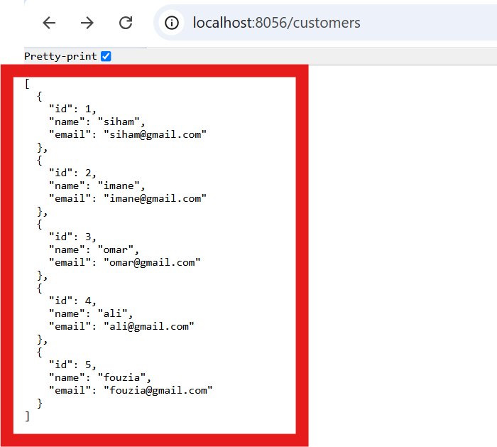
et vpila donc tt nos customers 
on va au bd ss url :
http://localhost:8056/h2-console

e voila ca faiche tt nos cyustomers 
 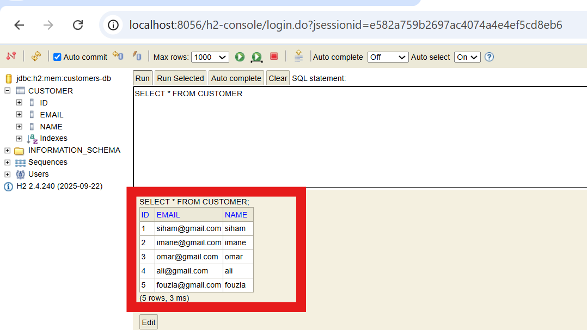

puis pon ajoute notre documentation swagger:
<dependency>
<groupId>org.springdoc</groupId>
<artifactId>springdoc-openapi-starter-webmvc-ui</artifactId>
<version>3.1.1</version>
</dependency>
et voila notre dweb api 
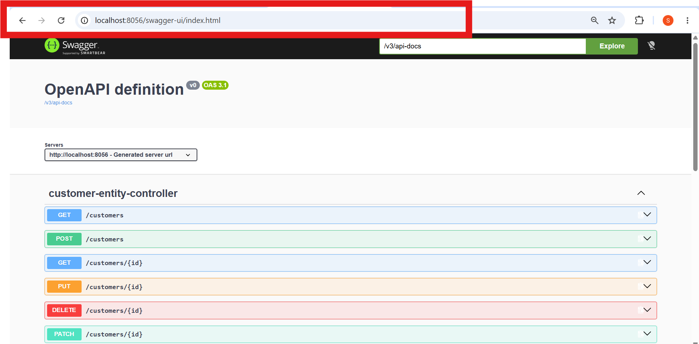
http://localhost:8056/swagger-ui/index.html
on etst les donc
GET
/customers
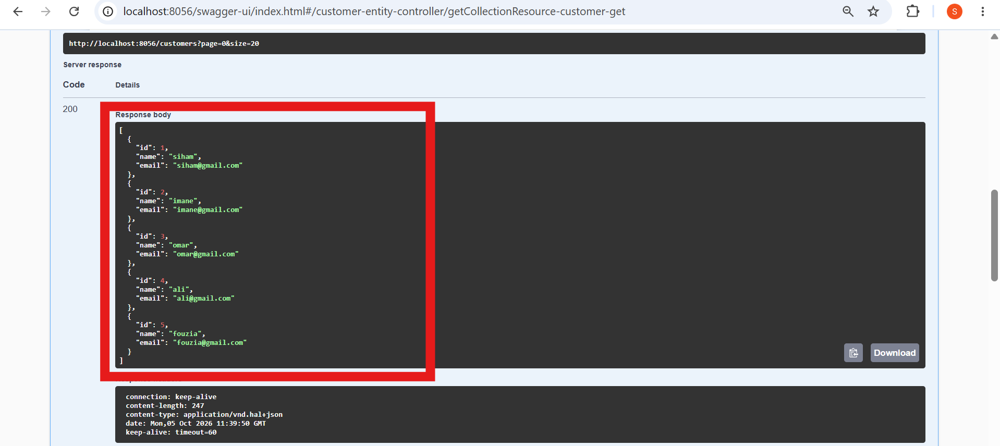


POST
/customers

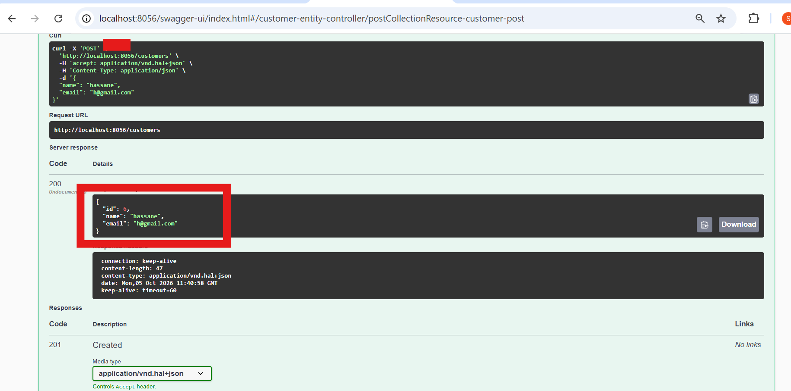

GET
/customers/{id}
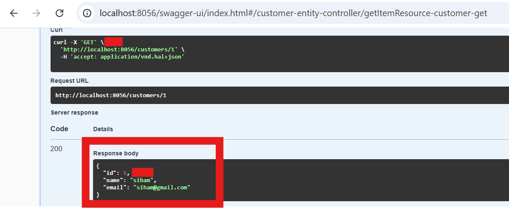
onn pase a creer notre ebank service:
avec el meme dependencies que custoemr service
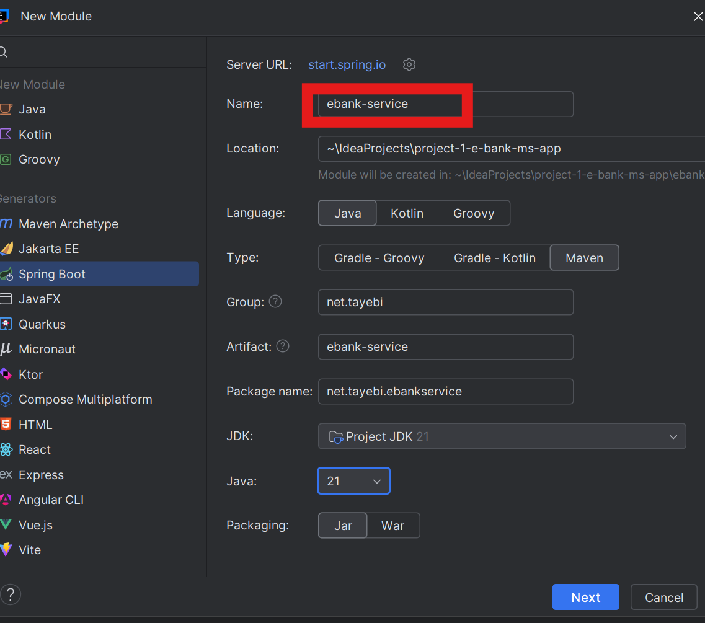
et on jaoute aussie
entities
└── BankAccount

repositories
└── BankAccountRepository

services
└── BankAccountService

controllers
└── BankAccountController
model
|____ Customer


package net.tayebi.ebankservice.services;

import net.tayebi.ebankservice.entities.BankAccount;
import net.tayebi.ebankservice.repositories.BankAccountRepository;
import org.springframework.stereotype.Service;

import java.util.List;

@Service
public class BankAccountService {
private BankAccountRepository accountRepository;

    public BankAccountService(BankAccountRepository accountRepository){
        this.accountRepository = accountRepository;
    }
    public List<BankAccount> getAllBankAccounts(){
        return accountRepository.findAll();
    }

    public BankAccount getBankAccountById(String id){
            return accountRepository.findById(id)
                    .orElseThrow(()->new RuntimeException("Account not found"));
    }

    public BankAccount save(BankAccount bankAccount){
                return accountRepository.save(bankAccount);
    }
}


package net.tayebi.ebankservice.controllers;

import net.tayebi.ebankservice.entities.BankAccount;
import net.tayebi.ebankservice.repositories.BankAccountRepository;
import net.tayebi.ebankservice.services.BankAccountService;
import org.springframework.beans.factory.annotation.Autowired;
import org.springframework.web.bind.annotation.*;

import java.util.List;

@RestController
public class BankAccountController {
@Autowired
private BankAccountService bankAccountService;

    @GetMapping("/accounts")
    public List<BankAccount> getAllBankAccounts(){
        return bankAccountService.getAllBankAccounts();
    }

    @GetMapping("/accounts/{id}")
    public BankAccount getBankAccountById(@PathVariable String id){
        return bankAccountService.getBankAccountById(id);
    }

    @PostMapping("/accounts")
    public BankAccount save(@RequestBody  BankAccount bankAccount){
        return bankAccountService.save(bankAccount);
    }

}


package net.tayebi.ebankservice.entities;

import jakarta.persistence.Id;
import jakarta.persistence.Transient;
import lombok.AllArgsConstructor;
import lombok.Getter;
import lombok.NoArgsConstructor;
import lombok.Setter;
import net.tayebi.ebankservice.model.Customer;

import java.util.Date;

@Getter
@Setter
@NoArgsConstructor
@AllArgsConstructor
public class BankAccount {
@Id
private String id;
private Date createdAt;
private double balance;
private String type;
private long customerId;
@Transient
private Customer customer;
}


package net.tayebi.ebankservice.model;

import lombok.*;

@Getter
@Setter
@NoArgsConstructor
@AllArgsConstructor
@Builder
public class Customer {
private Long id;
private String name;
private String email;
}


package net.tayebi.ebankservice.repositories;

import net.tayebi.ebankservice.entities.BankAccount;
import org.springframework.data.jpa.repository.JpaRepository;

import java.util.List;

public interface BankAccountRepository extends JpaRepository<BankAccount, String> {

    List<BankAccount> findByCustomerId(Long id);
}

on pase dan sbean a se service pour cree rdes acounts

package net.tayebi.ebankservice;

import net.tayebi.ebankservice.entities.BankAccount;
import net.tayebi.ebankservice.repositories.BankAccountRepository;
import net.tayebi.ebankservice.services.BankAccountService;
import org.springframework.boot.CommandLineRunner;
import org.springframework.boot.SpringApplication;
import org.springframework.boot.autoconfigure.SpringBootApplication;
import org.springframework.context.annotation.Bean;

@SpringBootApplication
public class EbankServiceApplication {

	public static void main(String[] args) {
		SpringApplication.run(EbankServiceApplication.class, args);
	}

	@Bean
	CommandLineRunner init(BankAccountService bankAccountService) {
		return args -> {
			for (int i = 1; i <= 3; i++) {
				for (int j = 0; j <5 ; j++) {
					bankAccountService.save(
							BankAccount.builder()
							. type (Math.random()>0.5? "CURRENT-ACCOUNT": "SAVING_ACCOUNT")
									.balance(1000+ Math.random()*60000)
									.customerId(i)
									.build());
				}
		};

	}

}

on pase au config de cet app ou de c microservice


spring.application.name=ebank-service
server.port=8057
eureka.client.enabled=false
spring.cloud.config.enabled=false
spring.cloud.discovery.enabled=false
spring.h2.console.enabled=true
on execute le donc
on tetste

avnmat on ajoute aussi de swagger
<dependency>
<groupId>org.springdoc</groupId>
<artifactId>springdoc-openapi-starter-webmvc-ui</artifactId>
<version>3.1.1</version>
</dependency>
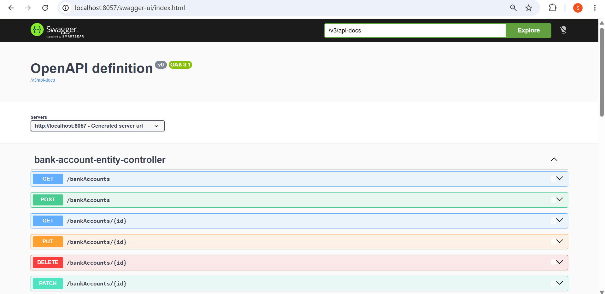
o ntets notre api domcn 
test gde get all 
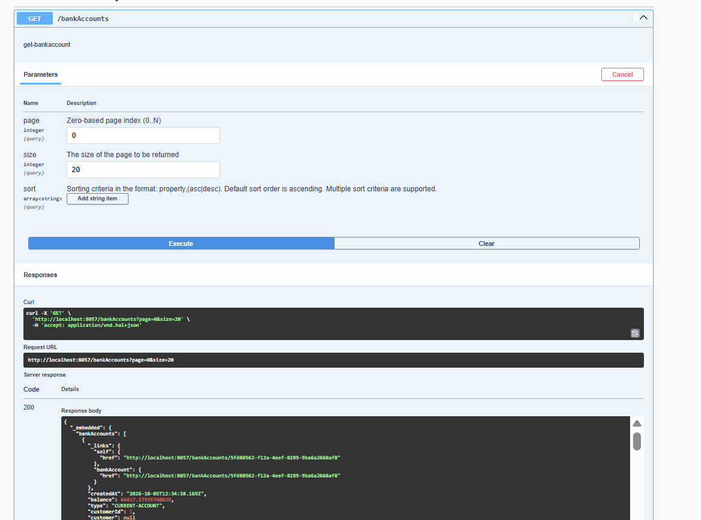

get by id 
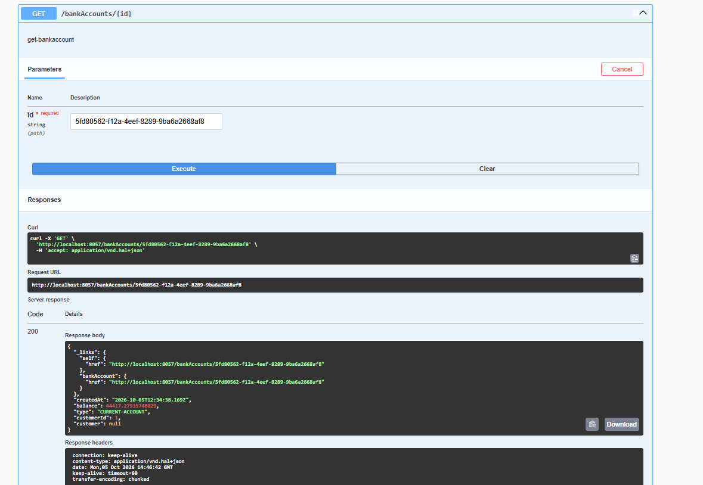

on passe a creer notre gaway service: avc depnednecies:
reactive gateway, discovery clin, actuiator

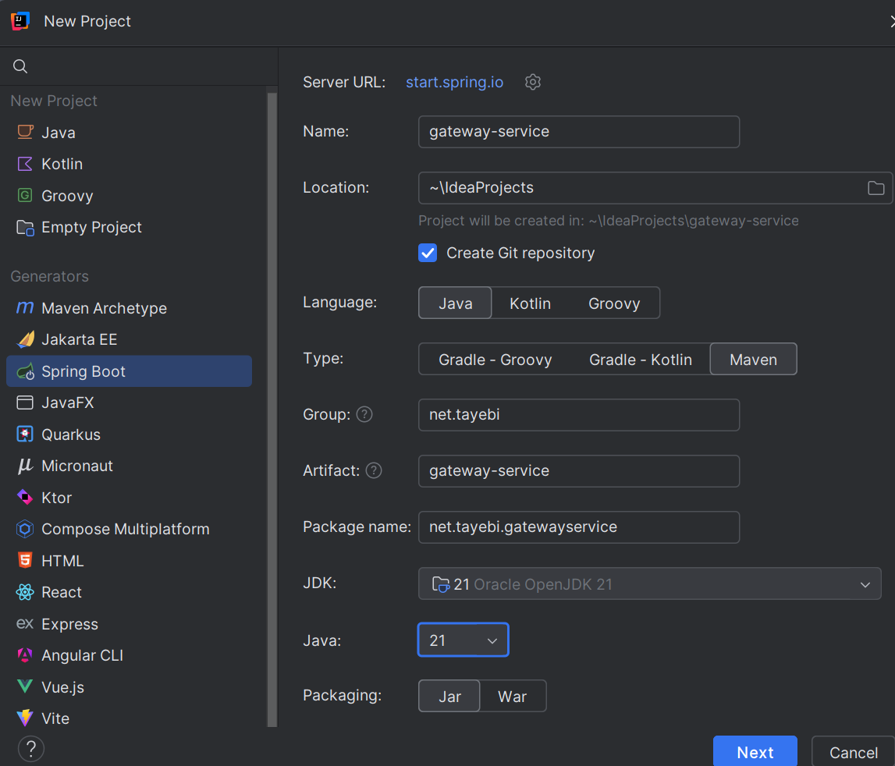


Pour rutage statique on utulsie sfiche de config .yaml

ca c rouage stattique:
spring:
cloud:
gateway:
server:
webflux:
routes:
- id : r1
uri: http://localhost:8056
predicates:
- Path= /customers/**
- id: r2
uri: http://localhost:8057
predicates:
- Path= /accounts/**


on passe au config de la gateway et ondesacive eureka pcq c pas encore cree
et voila donc an tetsr 
ca nmarche  http://localhost:9999/customers
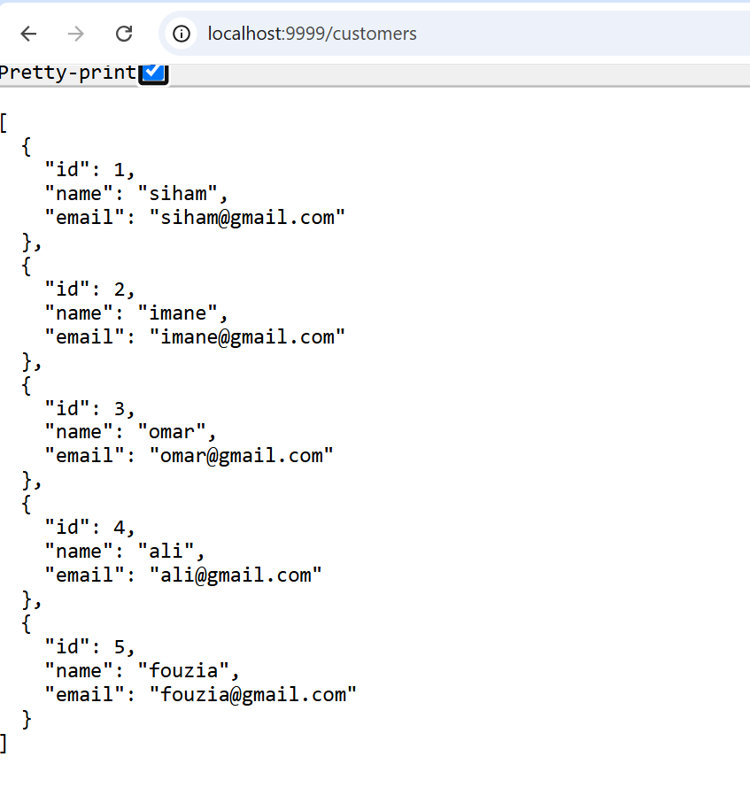


et aussi  ca marche : http://localhost:9999/accounts
 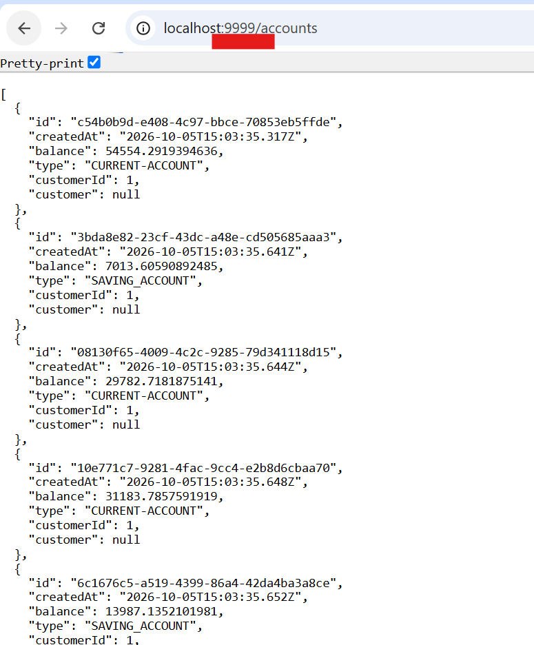

ca sc rouage sttaiuqe onpasse acrrer notre discprvey service
avec depndencies:
eureka servcer,actuator
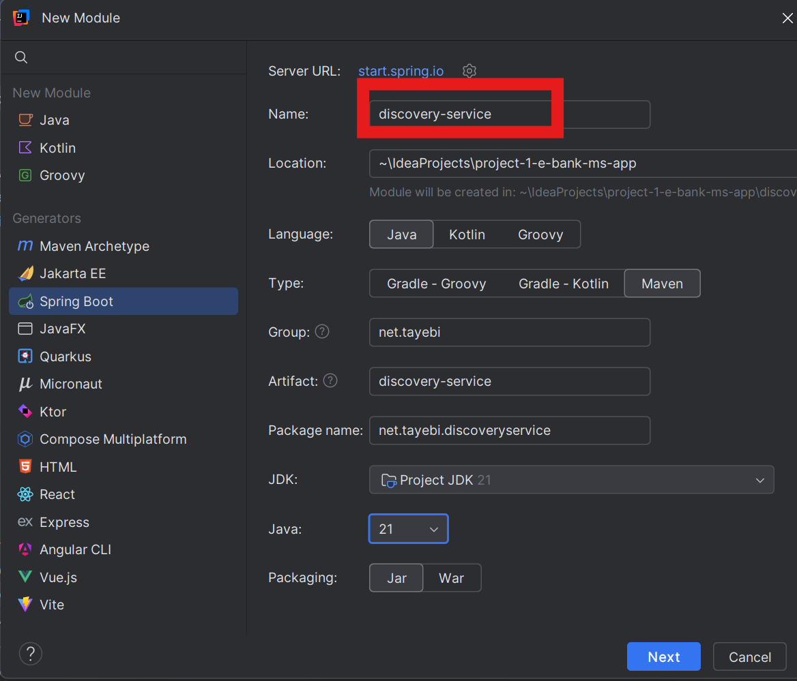

avec port 8761
spring.application.name=discovery-service
server.port=8761
on desacive donc fetch registry et register  car  sui on les active une fosi elle demarr eil vont cherche a senresgistetr et c pas utilsie
spring.application.name=discovery-service
server.port=8761
eureka.client.fetch-registry=false
eureka.client.register-with-eureka=false
on enbale eureka server sinn ca va pas marche
package net.tayebi.discoveryservice;
import org.springframework.boot.SpringApplication;
import org.springframework.boot.autoconfigure.SpringBootApplication;
import org.springframework.cloud.netflix.eureka.server.EnableEurekaServer;

@SpringBootApplication
@EnableEurekaServer
public class DiscoveryServiceApplication {

	public static void main(String[] args) {
		SpringApplication.run(DiscoveryServiceApplication.class, args);
	}

}

on exec et c bn pur lurl ca marhce
http://localhost:8761/
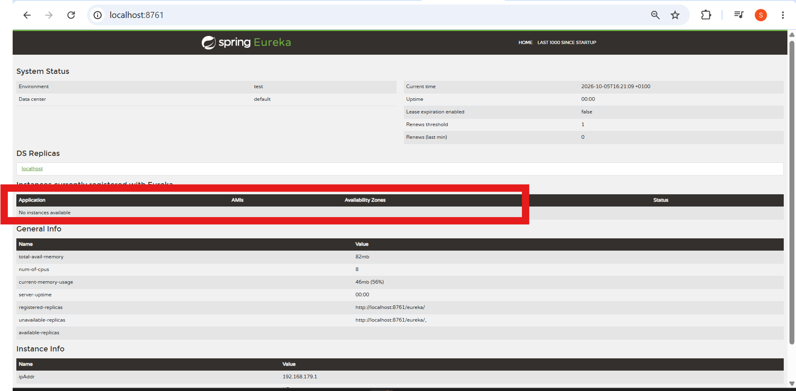


pour le moememn aucun service  nes t uenregistre pour se faire on reveient a leur config et on  active discovery
dan amain sicovery sevrice :
avec
spring.cloud.config.discovery.enabled=true // pour toruvr ma ip contac eureka
eureka.client.enabled=true //je veux utilsier euraka pour snenrgeizter


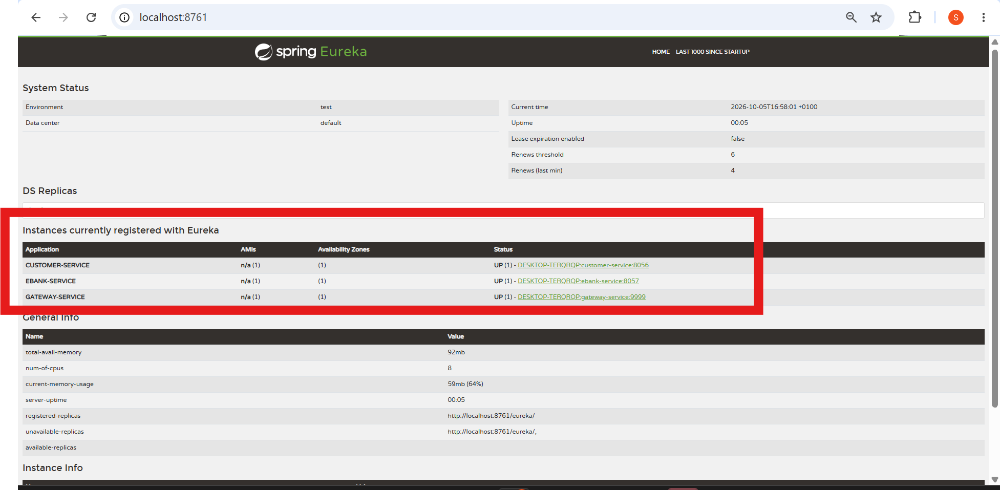

maintnenn on doi etablir un communictaion entre scutsem r svrice et bank via open feign  dans nore ebnak-service
<dependency>
<groupId>org.springframework.cloud</groupId>
<artifactId>spring-cloud-starter-netflix-eureka-client</artifactId>
</dependency>
pis on ajoute repo feign dna sebank service
<dependency>
<groupId>org.springframework.cloud</groupId>
<artifactId>spring-cloud-starter-openfeign</artifactId>
</dependency>

package net.tayebi.ebankservice.feign;

import net.tayebi.ebankservice.model.Customer;
import org.springframework.cloud.openfeign.FeignClient;
import org.springframework.web.bind.annotation.GetMapping;
import org.springframework.web.bind.annotation.PathVariable;

@FeignClient(name = "customer-service")
public interface CustomerRestClient {
@GetMapping("/customers/{id}")
public Customer getCustomer(@PathVariable int id) ;
}

ici envoi req avc id puis recucper le et le stcoke dans obj cusotmer cree et pur que ca amrhc efaut beosi  d config sys de routage de maniere dynamiqu n meemtnan app/yaml en comemnt et creer les anotaion
via meth reactive dscovery cleint dans gateway
package net.tayebi.gatewayservice;

import com.netflix.discovery.DiscoveryClient;
import org.springframework.boot.SpringApplication;
import org.springframework.boot.autoconfigure.SpringBootApplication;
import org.springframework.boot.web.server.autoconfigure.ServerProperties;
import org.springframework.cloud.client.discovery.ReactiveDiscoveryClient;
import org.springframework.cloud.gateway.discovery.DiscoveryClientRouteDefinitionLocator;
import org.springframework.cloud.gateway.discovery.DiscoveryLocatorProperties;
import org.springframework.context.annotation.Bean;

@SpringBootApplication
public class GatewayServiceApplication {

	public static void main(String[] args) {
		SpringApplication.run(GatewayServiceApplication.class, args);
	}
	@Bean
	DiscoveryClientRouteDefinitionLocator routes(ReactiveDiscoveryClient rdc, DiscoveryLocatorProperties dlp) {
		return new DiscoveryClientRouteDefinitionLocator(rdc, dlp);
	}

}
 et on redemmarre
geatweay et donc si on met ca va marhce http://localhost:9999/accounts 
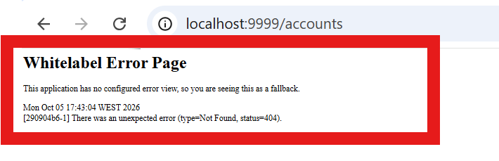
on doit metr enom de sevcie commeca avec nom servcie majuscul acr defau  cenrgsier dna sdiscoveyr en majuscule
http://localhost:9999/EBANK-SERVICE/accounts
et camache
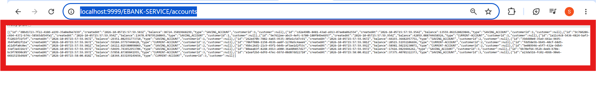

http://localhost:9999/CUSTOMER-SERVICE/customers
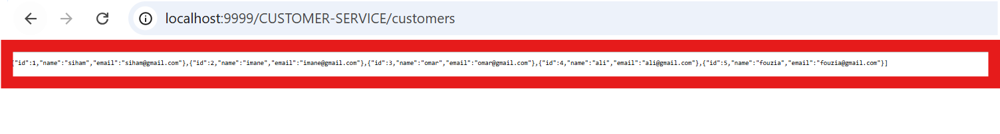
on va au sevrie de ebnak et on essya ede recucu e customer vai noe res client mehods
pour que je peux ajouer bean objr dan smon sevic eje dois fair e
@EnableFeignClients
dans main puis je peux fiar
package net.tayebi.ebankservice.services;

import lombok.AllArgsConstructor;
import net.tayebi.ebankservice.entities.BankAccount;
import net.tayebi.ebankservice.feign.CustomerRestClient;
import net.tayebi.ebankservice.repositories.BankAccountRepository;
import org.springframework.beans.factory.annotation.Autowired;
import org.springframework.stereotype.Service;

import java.util.Date;
import java.util.List;
import java.util.UUID;

@Service
@AllArgsConstructor

public class BankAccountService {

    private BankAccountRepository accountRepository;
    private CustomerRestClient customerRestClient;

    public List<BankAccount> getAllBankAccounts(){
        return accountRepository.findAll();
    }

    public BankAccount getBankAccountById(String id){
            BankAccount bankAccount= accountRepository.findById(id)
                    .orElseThrow(()->new RuntimeException("Account not found"));
            bankAccount.setCustomer(customerRestClient.getCustomer(bankAccount.getCustomerId()));
        return bankAccount;
    }

    public BankAccount save(BankAccount bankAccount){
                bankAccount.setId(UUID.randomUUID().toString());
                bankAccount.setCreatedAt(new Date());
                return accountRepository.save(bankAccount);
    }
}

on test ebank open feign cerre un clien  rets de mnaier edecalraive
enable feign cleint c pour auoiser linjceion dna ses client
c bon ca mrcenbien http://localhost:9999/EBANK-SERVICE/accounts/63123a42-365a-4616-9684-6ba57e741a8c
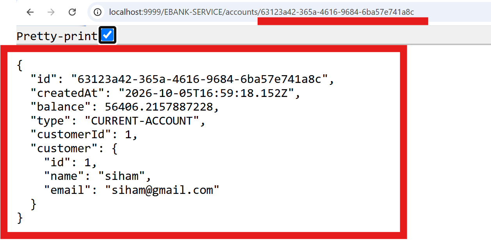
la on a co mpte avec ebank servcie  avec info de customer a laide de cusomer sevrce
la on apsse a on peut peas enrgster un acocut  si aps de iuser cusomer
public BankAccount save(BankAccount bankAccount){
try {
Customer customer = customerRestClient.getCustomer(bankAccount.getCustomerId());
bankAccount.setId(UUID.randomUUID().toString());
bankAccount.setCreatedAt(new Date());
return accountRepository.save(bankAccount);

        } catch (RuntimeException e) {
            throw new RuntimeException(e.getMessage());
        }
    }
}
c a nosu de gere les rreles dintegerite refrernetiel
la on va utilsie ror four tlerance rsilence 4 j pour resoudre prob tolerance au panne
on ejoute dep resilen 4 j et ciruit breaker pour que si srvice n ps dispo 
on ajoute circuit breaker pour les meth qui peuvtne genrer des excpetion pour le diirger vrs defiual  meth for exmple
package net.tayebi.ebankservice.feign;

import io.github.resilience4j.circuitbreaker.annotation.CircuitBreaker;
import net.tayebi.ebankservice.model.Customer;
import org.springframework.cloud.openfeign.FeignClient;
import org.springframework.web.bind.annotation.GetMapping;
import org.springframework.web.bind.annotation.PathVariable;

@FeignClient(name = "customer-service")

public interface CustomerRestClient {
@GetMapping("/customers/{id}")
@CircuitBreaker(name = "customer-service",fallbackMethod = "defaultCustomerMethod")
public Customer getCustomer(@PathVariable long id) ;
default  Customer defaultCustomerMethod(Exception e, Long id) {
return new Customer(id,"Default name","default@gmail.com");

    }
}

on teste par arreter couomr servcie pour voir ce uqil va afiche 
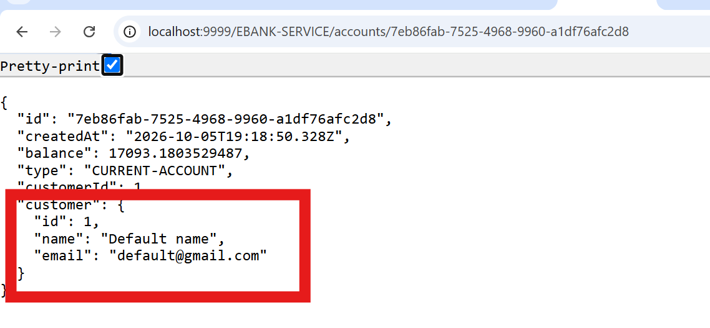
 la on defaults car servcie cutomer arrete
on le realumeet a macreh
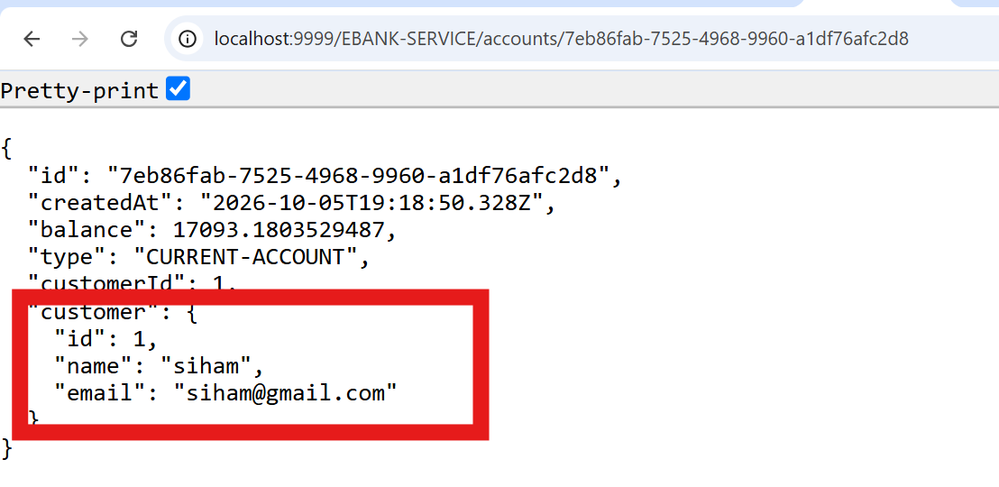
PARTIE 2:ON PASSE A LA CREATION DU CHATBOT  AVEC MCP

PARIE3;ET FROBTEND ANGULAR AVC CLIENT TLEGRAM

APRES SECURITE AVEC KEKLCOCK ETC